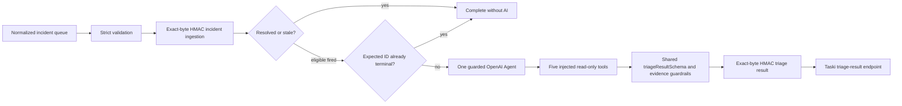

# Architecture

## Batch 5B extension

The official Agents SDK runs exactly one Agent with the existing Batch 1 schema as `outputType`, a bounded `AbortSignal`, and low `maxTurns`. The worker exposes no handoffs, hosted tools, MCP, shell, filesystem, computer, code execution, or remediation.

Every tool accepts `{}` and derives scope from the current incident. Injected providers implement service health, recent error summary, resource metrics, latest deployment, and matching runbook lookups. Each tool returns at most two evidence entries and the workflow records at most ten total. The current runtime provider returns unavailable; Batch 6 will connect real allowlisted Azure diagnostic providers.

OpenAI timeout/refusal/invalid output is converted to a safe failed envelope. Taski result-delivery failure and real conflict throw. `analysisId` is deterministic over provider, external alert ID, source delivery ID, and policy version. After ingestion, an exact matching `ready`, `failed`, or `not_required` identity proves Taski already accepted that policy-bound analysis and suppresses recreation after a lost response. Null, mismatched, `pending`, `queued`, and `investigating` identities remain eligible.

Taski transport configuration is validated before ingestion. Triage policy identity and OpenAI execution configuration are consulted lazily only for eligible fired incidents. This ordering lets resolved, already-resolved, and stale alerts complete without OpenAI settings. The accepted-identity check is not a distributed claim or lease: simultaneous duplicates can both start OpenAI before either persists a result, and exactly-once model execution is not claimed.

## Batch 4 queue-first path

```mermaid
flowchart LR
  monitor["Azure Monitor Action Group (future)"] --> receiver["HTTP Function: receiveAzureAlert"]
  receiver --> validate["Validate Common Alert Schema"]
  validate --> normalize["Normalize allowlisted incident"]
  normalize --> queue["Azure Queue: taski-incident-events"]
  queue --> processor["Queue Function: processIncident"]
  processor --> revalidate["Validate normalized incident again"]
  revalidate --> sign["Serialize once and sign exact bytes"]
  sign --> taski["Taski internal incident endpoint"]
```

The HTTP receiver assigns only canonical normalized JSON to the queue binding and then returns `202`. It has no Taski client dependency and performs no outbound HTTP request. The queue processor is the sole Taski caller.

## Repository boundary

This repository owns Azure-facing intake, Common Alert Schema validation, normalization, deterministic delivery identity, queue processing, and authenticated delivery. Taski remains a separate database-backed collaboration system and owns group authorization, incident persistence, realtime cards, acknowledgement, and Task creation. No Taski source or database code is copied here.

## Function registration and build

The implementation uses the Azure Functions Node.js programming model v4:

- `app.http` registers `receiveAzureAlert`;
- `output.storageQueue` provides its secondary queue output;
- `app.storageQueue` registers `processIncident`;
- `%AZURE_INCIDENT_QUEUE_NAME%` resolves the queue application setting;
- `AzureWebJobsStorage` is the standard binding connection setting;
- `package.json` loads both compiled registration modules through `dist/src/functions/*.js`.

The registrations are thin. Deterministic receiver, processor, signing, and HTTP behavior live in independently tested modules.

`AzureWebJobsStorage` is resolved by the Functions host. Application code neither reads it nor requires a plaintext value, so identity-based `AzureWebJobsStorage__*` settings remain compatible. The deployment package root contains `host.json`, `package.json`, the TypeScript build inputs needed for the Linux remote build, and production output under `dist/src`. `.funcignore` prevents tests, fixtures, local settings, local dependencies, docs, and development-only compiled files from entering the uploaded project package.

## Message boundaries

The queue contains the strict normalized incident only. It contains no raw `alertContext`, `customProperties`, headers, Function key, Taski key, signature, secret, or OpenAI data. `messageEncoding: none` matches the plain canonical JSON string produced by the output binding. The trigger may expose valid JSON as an object; either representation is strictly revalidated.

The Taski request body is serialized exactly once after queue validation. The same immutable bytes are supplied to HMAC and `fetch`.

## Correlation and failure

`externalAlertId` correlates fired and resolved states. `deliveryId` is deterministic over stable provider fields and excludes `receivedAt`. Taski owns durable idempotency and returns `created`, `updated`, `duplicate`, or `stale`; all four are successful queue completion states.

Any malformed queue message, configuration error, timeout, network failure, non-2xx response, redirect, or invalid Taski response throws. Azure retries up to `maxDequeueCount: 5`, then uses the conventional `<queue-name>-poison` queue. There is no custom retry loop or automatic remediation.

## Next batch boundary

Batch 5B implements the local guarded AI step described above. Batch 6 may connect real Azure Monitor diagnostic adapters only after RBAC, privacy, deployment, and operational review; it must preserve resource scoping, evidence bounds, read-only behavior, and human approval.
