# Architecture

## Batch 4 queue-first path

```mermaid
flowchart LR
  monitor["Azure Monitor Action Group (future)"] --> receiver["HTTP Function: receiveAzureAlert"]
  receiver --> validate["Validate Common Alert Schema"]
  validate --> normalize["Normalize allowlisted incident"]
  normalize --> queue["Azure Queue: taski-incident-events"]
  queue --> processor["Queue Function: processIncident"]
  processor --> revalidate["Validate normalized incident again"]
  revalidate --> sign["Serialize once and sign exact bytes"]
  sign --> taski["Taski internal incident endpoint"]
```

The HTTP receiver assigns only canonical normalized JSON to the queue binding and then returns `202`. It has no Taski client dependency and performs no outbound HTTP request. The queue processor is the sole Taski caller.

## Repository boundary

This repository owns Azure-facing intake, Common Alert Schema validation, normalization, deterministic delivery identity, queue processing, and authenticated delivery. Taski remains a separate database-backed collaboration system and owns group authorization, incident persistence, realtime cards, acknowledgement, and Task creation. No Taski source or database code is copied here.

## Function registration and build

The implementation uses the Azure Functions Node.js programming model v4:

- `app.http` registers `receiveAzureAlert`;
- `output.storageQueue` provides its secondary queue output;
- `app.storageQueue` registers `processIncident`;
- `%AZURE_INCIDENT_QUEUE_NAME%` resolves the queue application setting;
- `AzureWebJobsStorage` is the standard binding connection setting;
- `package.json` loads both compiled registration modules through `dist/src/functions/*.js`.

The registrations are thin. Deterministic receiver, processor, signing, and HTTP behavior live in independently tested modules.

## Message boundaries

The queue contains the strict normalized incident only. It contains no raw `alertContext`, `customProperties`, headers, Function key, Taski key, signature, secret, or OpenAI data. `messageEncoding: none` matches the plain canonical JSON string produced by the output binding. The trigger may expose valid JSON as an object; either representation is strictly revalidated.

The Taski request body is serialized exactly once after queue validation. The same immutable bytes are supplied to HMAC and `fetch`.

## Correlation and failure

`externalAlertId` correlates fired and resolved states. `deliveryId` is deterministic over stable provider fields and excludes `receivedAt`. Taski owns durable idempotency and returns `created`, `updated`, `duplicate`, or `stale`; all four are successful queue completion states.

Any malformed queue message, configuration error, timeout, network failure, non-2xx response, redirect, or invalid Taski response throws. Azure retries up to `maxDequeueCount: 5`, then uses the conventional `<queue-name>-poison` queue. There is no custom retry loop or automatic remediation.

## Next batch boundary

Batch 4 does not invoke OpenAI or gather diagnostics. Batch 5 may add read-only AI triage only after the persistent incident handoff exists; it must preserve the queue, authorization, strict contract, and human-approval boundaries.
