# Architecture

## Target end-to-end path

```mermaid
flowchart LR
  monitor["Azure Monitor Action Group"] --> receiver["Authenticated Azure receiver"]
  receiver --> normalize["Validate and normalize alert"]
  normalize --> queue["Durable incident queue"]
  queue --> worker["Read-only triage worker"]
  worker --> result["Strict triage result"]
  result --> taski["Taski incident API"]
  taski --> group["Authorized Taski group card"]
  group --> approval["Human acknowledgement or Create Task approval"]
```

The target is queue-first: receipt and validation must finish without waiting for diagnostics or an AI model. A queued worker can fail or retry without preventing initial incident creation.

## Responsibility boundary

This repository is responsible for Azure-facing intake, Common Alert Schema validation, normalization, deterministic delivery identity, future queue processing, read-only evidence gathering, and strict triage output.

Taski remains the database-backed collaboration system. It owns users, group authorization, persistent incident presentation, acknowledgement, realtime UI updates, and Task creation. This repository does not copy Taski source or redefine its collaboration model.

## Correlation and idempotency

- `externalAlertId` is the stable provider alert identity used to correlate fired and resolved states.
- `condition` distinguishes fired from resolved.
- `deliveryId` is a SHA-256 digest of canonical stable normalized provider fields.
- Canonical JSON recursively sorts object keys and preserves array order.
- `deliveryId` excludes receipt time, local timezone, property order, and randomness.
- Exact duplicate deliveries produce the same ID; fired and resolved deliveries produce different IDs.

Batch 1 calculates identities only. Durable uniqueness constraints, nonce storage, replay windows, and fired/resolved persistence belong to later batches.

## Batch boundaries

Batch 1 contains deterministic contracts, fixtures, tests, documentation, and a local replay CLI. It has no network transport, queue, database, Azure SDK, OpenAI SDK, Taski client, or deployment configuration.

Later batches may add, in order: authenticated receiver, durable queue, incident persistence handoff, read-only evidence tools, strict model invocation, Taski delivery, observability, and production hardening.
